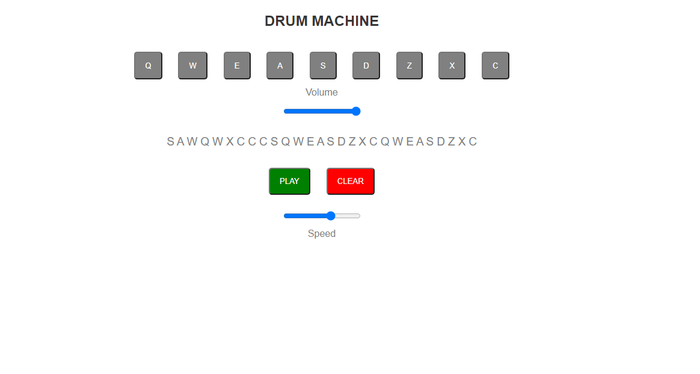

# Getting Started with Create React App

This project was bootstrapped with [Create React App](https://github.com/facebook/create-react-app).

# Free code Camp - Drum Machine solution

This is a solution to the [Drum Machine challenge on Free Code Camp

## Table of contents

- [Overview](#overview)
  - [The challenge](#the-challenge)
  - [Screenshot](#screenshot)
  - [Links](#links)
- [My process](#my-process)
  - [Built with](#built-with)
  - [Useful resources](#useful-resources)
- [Author](#author)

## Overview

### The challenge

Users should be able to:

- Click on a .drum-pad element, the audio clip contained in its child audio element should be triggered.

- Press the trigger key associated with each .drum-pad, the audio clip contained in its child audio element should be triggered (e.g. pressing the Q key should trigger the drum pad which contains the string Q, pressing the W key should trigger the drum pad which contains the string W, etc.).

-  View a string describing the associated audio clip is displayed as the inner text of the #display element (each string must be unique).

### Screenshot

### Links

- Solution URL: [https://github.com/PrincessMaggy/drum-machine.git]
- Live Site URL: [https://princessmaggy.github.io/drum-machine/]

## My process
- I set up react usind node js.
- I copied the links to audio clips online and set it up as an array
- I created the pad component and added some functionalities.
- I styled the project using sass.
- I hosted the project on github.
- I fixed impending bugs in the project.

### Built with

- Semantic HTML5 markup
- Sass
- React

## Useful Resources
[https://www.youtube.com/watch?v=HTTaO1IjjlM]
## Author

- Website - [PrincessMaggy](https://princessmaggy.github.io/My-Portfolio/)
- Twitter - [@princessmaggy7](https://www.twitter.com/princessmaggy7)
